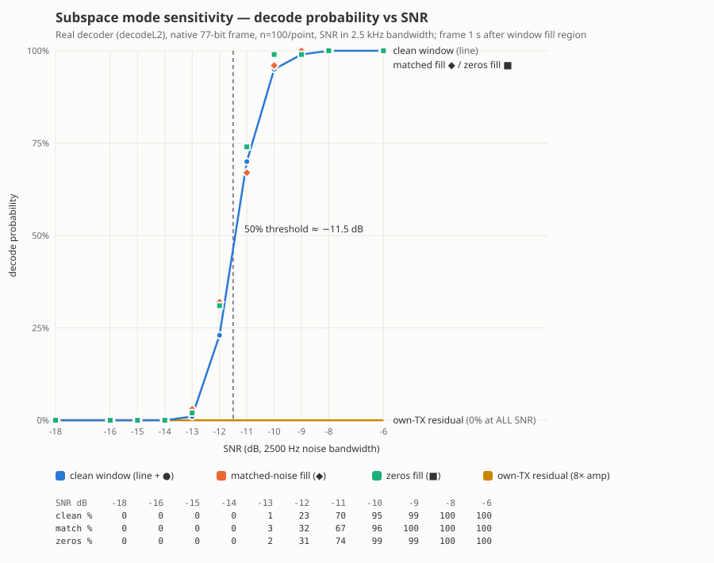

# Subspace mode sensitivity (measured 2026-08-06)

Decode probability vs SNR through the production decoder
(`DecodeFT2::decodeL2`, the same entry point the app's receive path
uses), native 77-bit frame synthesized via `ft2_encode_from_bits_c`,
bit-exact decode verification, 100 trials per point, SNR referenced
to 2500 Hz noise bandwidth. Frame placed 1 s after a 3.5 s
conditioned region in the 7.5 s decode window.

| SNR dB | clean window | matched-noise fill | zeros fill | own-TX residual (8×) |
|---|---|---|---|---|
| −14 | 0% | 0% | 0% | 0% |
| −13 | 1% | 3% | 2% | 0% |
| −12 | 23% | 32% | 31% | 0% |
| −11 | 70% | 67% | 74% | 0% |
| −10 | 95% | 96% | 99% | 0% |
| −9 … 0 | ~100% | ~100% | ~100% | 0% |

Findings:

- **50% decode threshold ≈ −11.5 dB**, a sharp LDPC waterfall
  (0→100% across ~4 dB). This is ~2.5 dB from the FT8-scaled ideal
  for a 2.52 s frame (FT8: −21 dB with 7 dB more integration time),
  accounted by 4-tone keying and the 16/103-symbol sync overhead —
  the decoder performs near the physical limit for its frame length.
- Window-fill policy (silence vs matched noise vs live noise in the
  older region) is **immaterial** for a frame arriving 1 s later —
  all three conditions produce one curve within sampling noise.
- A strong in-window own-transmission residual (8× frame amplitude,
  occupying the older half of the window) **kills decode entirely at
  every SNR tested including 0 dB** (0/1200): decode probability is
  governed by signal-to-residual ratio, not SNR.

Harness: `~/bench-fill/fill_harness.cpp` (bench rig, links the build
tree's decoder objects; not part of the shipped application). Caveat:
the synthetic SNR calibration has not yet been cross-checked against
the decoder's own reported SNR.
